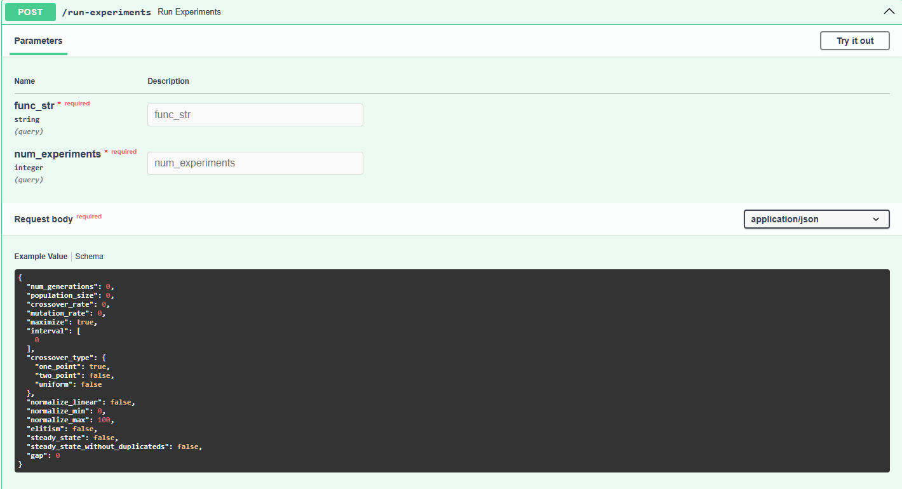

******************************
Run Experiments Method (POST)
******************************

This is the **core endpoint** of the GADEMO API, responsible for executing the genetic algorithm based on custom user parameters and returning structured evolutionary data.

Overview
--------

- **Method**: POST
- **Endpoint**: ``/run-experiments``
- **Response Format**: JSON

This method takes in a mathematical function and a number of experiments to run. It returns a full record of the algorithm's behavior across all experiments and generations.

Parameters (Query)
------------------

- **func_str** *(string, required)*:  
  The objective function to be optimized. Must be expressed in valid Python-like math syntax (e.g., ``sin(x) + cos(y)``).

- **num_experiments** *(integer, required)*:  
  The number of independent experiments (runs) to be executed using the same configuration.

Request Body (JSON)
-------------------

The body must be a JSON object specifying the algorithm’s configuration:

.. code-block:: json

    {
      "num_generations": 3,
      "population_size": 10,
      "crossover_rate": 65,
      "mutation_rate": 0.80,
      "maximize": true,
      "interval": [-100, 100],
      "crossover_type": {
        "one_point": true,
        "two_point": false,
        "uniform": false
      },
      "normalize_linear": false,
      "normalize_min": 0,
      "normalize_max": 100,
      "elitism": false,
      "steady_state": false,
      "steady_state_without_duplicateds": false,
      "gap": 0
    }

Endpoint
--------

**Request URL (example):**

.. code-block:: text

   https://servicosmaxwell.vrac.puc-rio.br/run-experiments?func_str=0.5%20-%20%28sin%28sqrt%28x%5E2%20%2B%20y%5E2%29%29%5E2%20-%200.5%29%20%2F%20%281%20%2B%200.001%20%2A%20%28x%5E2%20%2B%20y%5E2%29%29%5E2&num_experiments=2

Response
--------

A successful response will return the following fields:

- **best_experiment_values**: Best fitness value obtained in each experiment.
- **best_individuals_per_generation**: Best individual (solution) at each generation.
- **mean_best_individuals_per_generation**: Mean fitness of best individuals across experiments per generation.
- **best_values_per_generation**: Evolution of best fitness values for all experiments.
- **last_generation_values**: Fitness distribution of all individuals in the final generation.
- **execution_time_seconds**: Total time spent running the experiments.

**Response Example** (using F6 function):

.. code-block:: json

    {
      "best_experiment_values": [
        0.5188708575694038,
        0.5123384091156766
      ],
      "best_individuals_per_generation": [
        [
          [-41.96, 73.63],
          [-41.96, 73.63],
          [-43.10, 45.96]
        ],
        [
          [35.77, 36.19],
          [35.77, 36.19],
          [35.77, 36.19]
        ]
      ],
      "mean_best_individuals_per_generation": [
        0.50986,
        0.50986,
        0.51560
      ],
      "best_values_per_generation": [
        [0.5073, 0.5073, 0.5188],
        [0.5123, 0.5123, 0.5123]
      ],
      "last_generation_values": [
        [0.50, 0.51, 0.50, 0.50, 0.50, 0.50, 0.51, 0.50, 0.50, 0.50],
        [0.50, 0.51, 0.50, 0.51, 0.51, 0.51, 0.51, 0.51, 0.51, 0.51]
      ],
      "execution_time_seconds": 0.2145
    }

This endpoint powers the entire GADEMO experimentation process and returns all data needed for statistical analysis, visualizations, and result inspection.

