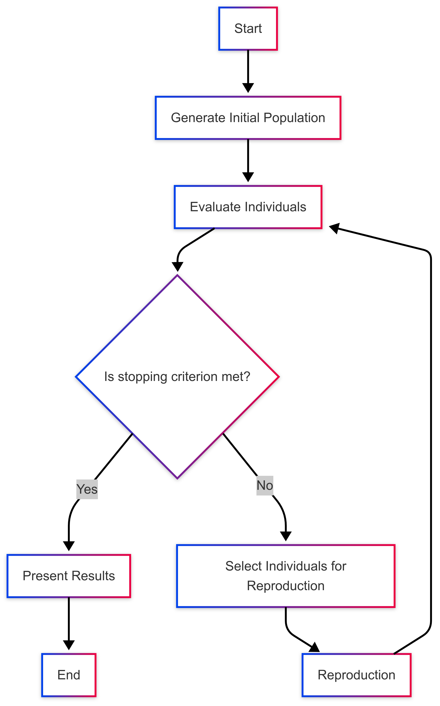

.. _ga_flow:

Genetic Algorithm Execution Flow in GADemo
==========================================

This section provides a detailed explanation of the genetic algorithm (GA) flow as implemented in GADemo, following the structure of the flowchart. Each step is described in natural language, without requiring the reader to interpret source code, focusing instead on the conceptual process and how GADemo applies it in practice.

1. Start
--------

Execution begins when the user defines a fitness function to be optimized and sets all configuration parameters. These parameters include:

- Population size
- Number of generations
- Crossover and mutation rates
- Type of crossover (one-point, two-point, or uniform)
- Whether to maximize or minimize
- Search interval for variables
- Optional features such as elitism, linear normalization, and steady-state execution

2. Generate Initial Population
------------------------------

GADemo generates an initial population of individuals. Each individual is **always composed of two real-valued variables**, regardless of whether the original function defined by the user is univariate or bivariate.

When the provided function is bivariate (e.g., f(x, y) = x² + y²), GADemo directly uses both genes (x and y) for evaluating the fitness of each individual.

However, when the function is univariate (e.g., f(x) = x²), GADemo automatically expands it into a bivariate version by summing the function evaluated at both x and y:  
**f(x, y) = f(x) + f(y)**.  
This transformation acts like a mirror across the y-axis, effectively generating a 3D surface from a 2D curve. It allows for uniform treatment of all individuals and enriches the search space by exploring symmetrical combinations.

Thus, all individuals in GADemo always have two variables, x and y. These variables are randomly initialized within the user-defined interval. This initial group of individuals forms generation zero.

3. Evaluate Individuals
-----------------------

Each individual is evaluated by applying the user-defined mathematical function. The result is stored as its fitness. If the linear normalization option is enabled, GADemo rescales the fitness values into a specific numeric range before proceeding to selection, enhancing the performance of the evolutionary process.

4. Is Stopping Criterion Met?
-----------------------------

GADemo uses a fixed-number-of-generations stopping criterion. That means the algorithm will always run for the exact number of generations specified by the user. It does not dynamically check for convergence or lack of improvement. When the maximum generation count is reached, execution ends.

5. If No: Select Individuals for Reproduction
---------------------------------------------

If the stopping criterion has not been reached, individuals are selected from the current population to serve as parents. GADemo uses tournament selection, where groups of individuals compete, and the fittest among each group is selected.

If the steady-state mode is activated, only a portion of the population (defined by the gap percentage) is selected for reproduction instead of the whole population.

6. Apply Crossover and Mutation (Reproduction)
----------------------------------------------

Selected individuals are recombined using crossover, the method of which (one-point, two-point, or uniform) is configured by the user. After crossover, mutation may occur: small random changes are applied to genes within their allowed intervals.

- In steady-state mode, offspring replace only part of the previous population.
- In generational mode (the default), the entire previous population is replaced by the offspring.

7. Elitism (Preservation of Best Individuals)
---------------------------------------------

If elitism is enabled, GADemo identifies and preserves the best individuals in each generation. One or two of the fittest individuals, depending on population size, are automatically carried over to the next generation. This guarantees that the best solutions found so far are not lost due to random variation.

8. Present Results
------------------

After all generations are complete, GADemo aggregates and displays the final population, the fitness values of all individuals in the last generation, and the best individual from each generation. These results are shown in both tabular and graphical formats to support analysis and interpretation.

9. End
------

Execution is finalized. The collected results are made available for the user to explore and export, enabling the interpretation of the algorithm's behavior and the evaluation of its performance.
