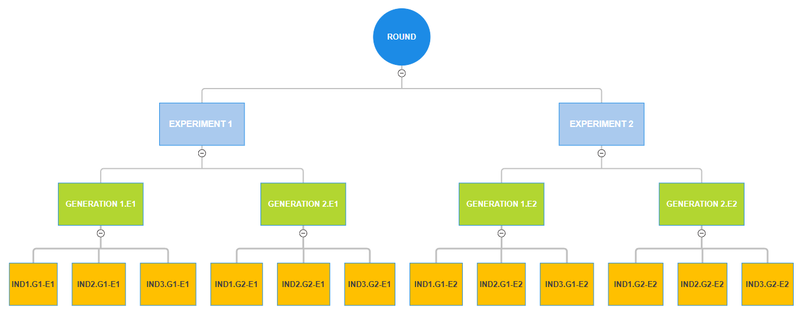

***************************************
Rounds, Experiments and Generations
***************************************

In order to correctly interpret the results and behavior of GADemo, it is essential to understand the three hierarchical concepts that structure the execution of the algorithm: **Rounds**, **Experiments**, and **Generations**. Each term defines a different level of abstraction and computational repetition, as explained below.

Understanding the Hierarchy
---------------------------

- **Round**  
  A **round** refers to a single user-triggered execution of GADemo — that is, each time the *Run* button is pressed, a new round is initiated.  
  Each round independently performs a set of experiments based on the user-defined parameters.

- **Experiment**  
  An **experiment** represents a complete execution of the genetic algorithm using a fixed configuration: number of generations, population size, crossover and mutation rates, and the selected objective function.  
  Multiple experiments are executed within a round, typically to assess variability and ensure statistical robustness through parallel runs.

- **Generation**  
  A **generation** corresponds to one iteration of evolution within an experiment.  
  In each generation, a new population is produced from the previous one through selection, crossover, and mutation operations. The number of generations defines how long each experiment evolves.

- **Population**  
  Within each generation, the **population** is the set of individuals (candidate solutions) currently being evaluated and evolved.  
  The size of this population is determined by the *Population Size* parameter set by the user.

Summary Table
^^^^^^^^^^^^^

+----------------+------------------------+----------------------------------------------------------+
| **Concept**    | **Scope**              | **Description**                                          |
+================+========================+==========================================================+
| Round          | Entire execution       | One click on “Run”; triggers all configured experiments  |
+----------------+------------------------+----------------------------------------------------------+
| Experiment     | Per round              | A full GA execution from generation 0 to N               |
+----------------+------------------------+----------------------------------------------------------+
| Generation     | Per experiment         | A single iteration of evolution                          |
+----------------+------------------------+----------------------------------------------------------+
| Population     | Per generation         | Set of individuals evaluated in the generation           |
+----------------+------------------------+----------------------------------------------------------+

Visual Representation
---------------------

To better illustrate this hierarchical structure:

::

    Round
    ├── Experiment 1
    │   ├── Generation 1
    │   ├── Generation 2
    │   └── ...
    ├── Experiment 2
    │   ├── Generation 1
    │   └── ...
    └── ...

Each level nests the next, emphasizing that a **single round** can generate **multiple experiments**, each of which evolves over **multiple generations**, with **populations** evaluated in every generation.

For instance, suppose the user configures:

- **Number of Experiments** = 2 
- **Number of Generations** = 2  
- **Population Size** = 3  

This implies that:

- Each **experiment** will evolve over 2 generations,
- In each generation, a population of 3 individuals is evaluated,
- Therefore, one **experiment** performs 2 × 3 = 6 evaluations,
- Across 2 experiments: 2 × 6 = 12 evaluations in total per **round**.

This numerical breakdown helps quantify the computational workload of a single run.

Understanding this structure is fundamental for correctly interpreting the outputs, visualizations, and comparative performance data generated by GADemo.
