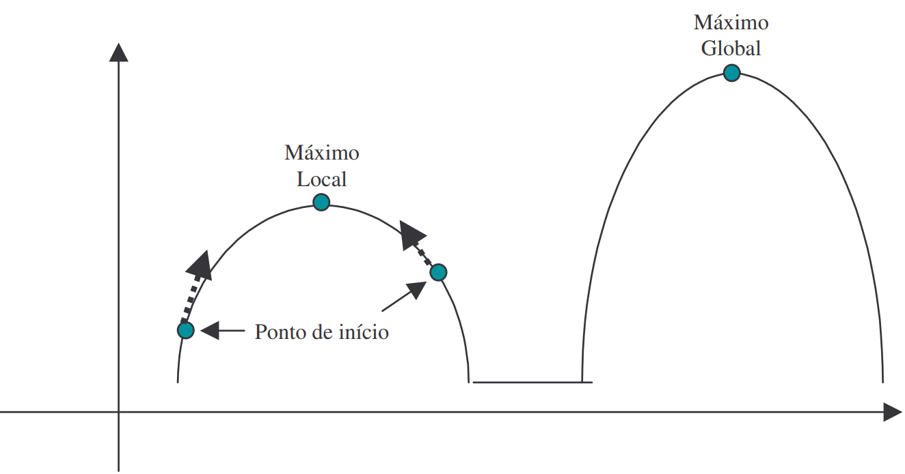

*********************************
What Are Genetic Algorithms?
*********************************

Genetic Algorithms (GAs) are a class of evolutionary algorithms inspired by the biological process of natural selection. Unlike traditional optimization methods such as *hill climbing*, which tend to get stuck in local optima, GAs use stochastic techniques to explore a broader solution space. This enables them to overcome local traps and converge toward more global solutions.

The figure below (Figure 1) illustrates the contrast between local and global optima. A search initiated from a given point using gradient-based methods might reach a local maximum and halt, as the gradient diminishes. In contrast, GAs simulate natural evolution by maintaining a diverse population of candidate solutions that undergo selection, crossover, and mutation. This population-based approach increases the probability of finding global optima over time.

   **Figure 1** - Schematic representation of a theoretical function with a local and global maximum. Gradient-based methods often converge prematurely to local optima, while Genetic Algorithms aim to escape these traps by exploring the broader solution space.

According to Linden (2006), the effectiveness of GAs lies in their population-based structure, where individuals evolve through successive generations via genetic operators. Inspired by Darwinian principles, GAs promote diversity and adaptability. Superior individuals are selected to reproduce, creating offspring that combine traits from previous generations through crossover and mutation.

A key component in this mechanism is the **fitness function**, which evaluates the quality of each solution. Over time, solutions that better satisfy the problem constraints are favored and propagated. Linden highlights that this process does not guarantee convergence to a single global solution, but instead emphasizes adaptability and robustness—qualities valuable in dynamic or poorly understood problem domains.

Furthermore, the genetic encoding of information in chromosomes allows GAs to tackle complex search spaces without being tightly coupled to the problem's mathematical formulation. Even when the same GA is executed multiple times, it may yield distinct results, enhancing its versatility.

In summary, GAs emulate the evolutionary process to incrementally improve solutions across generations. By balancing exploration (diversity) and exploitation (selection), they offer a powerful framework for solving a wide array of optimization problems.

