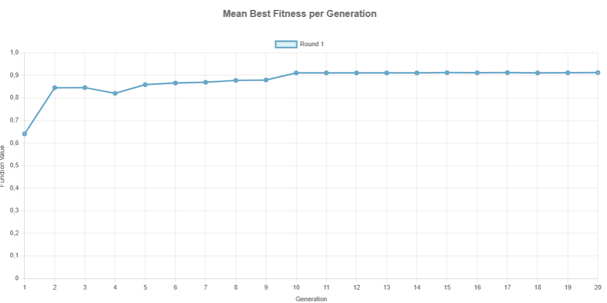
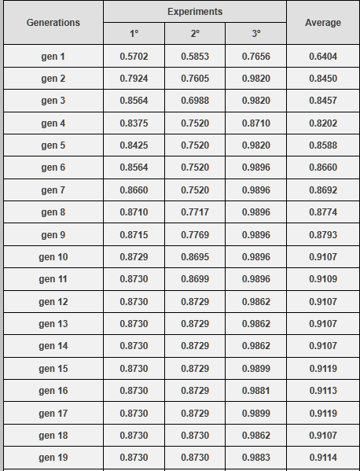
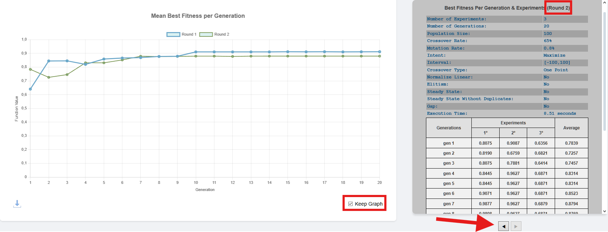

****************************************
Average of Best Fitness Per Generation
****************************************

This section provides a detailed view of how the **best individual** in each generation evolves across all **experiments** within a given **round**. The data is represented in a line chart that displays the **mean best fitness** per generation.

Each point in the curve represents the **average fitness value** of the best individual from each experiment for a given generation.

To illustrate how this is computed, consider the table shown below:

Take **generation 1** as an example:

- Experiment 1: Best fitness = 0.5702  
- Experiment 2: Best fitness = 0.5853  
- Experiment 3: Best fitness = 0.7656  
- **Average** = (0.5702 + 0.5853 + 0.7656) / 3 = **0.6404**

This average value is plotted as the point corresponding to generation 1 on the chart.

The same process is repeated for all 20 generations, producing a smooth curve that allows the user to evaluate:

- **Convergence speed**: How quickly the algorithm approaches optimal values.
- **Stability**: Whether the curve stabilizes or oscillates.
- **Performance**: General fitness trend across time.

**Note:** This visualization is fundamental to assess the efficiency of parameter settings and identify whether the genetic algorithm is behaving as expected.

Keep Graph and Navigating Between Rounds
****************************************

When the **Keep Graph** checkbox is selected, GADEMO stores the results of each new **round** without erasing the data from previous executions. This allows the user to **accumulate** multiple rounds and visualize their evolution in the same chart, which is essential for comparative performance analysis.

As shown above:

- The **checkbox Keep Graph** (bottom right) allows **retaining previous results** when running a new round.
- The **left/right arrow buttons** (below the result table) let the user **navigate through the stored rounds**, displaying the parameters and detailed table for each execution.

For instance, in the example above:
- Round 1 and Round 2 are both plotted on the graph.
- The table currently displayed refers to **Round 2**, as indicated at the top right of the table section.

.. important::

   If the **Keep Graph** checkbox is **unchecked**, all previous results will be **erased** when a new round is executed.
   Therefore, if the user wants to keep a cumulative visual history of all runs, **they must keep this checkbox selected before pressing Run**.

