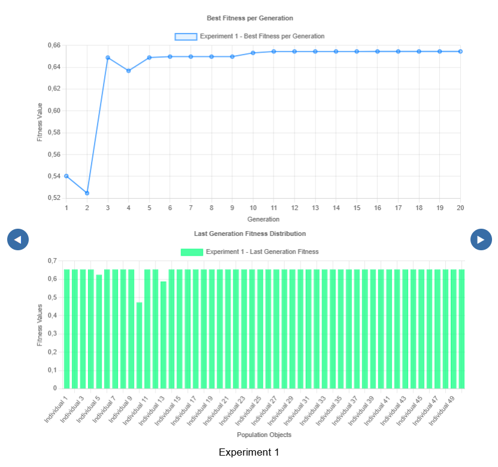

*******************************************************
Best Fitness Progression and Last Generation Analysis
*******************************************************

This section presents a detailed analysis of each **individual experiment** within the most recently executed round. Unlike previous charts which aggregate data across multiple experiments or rounds, this analysis is specific to a **single experiment** at a time.

The container includes two key visualizations:

**1. Best Fitness per Generation (Top Chart)**  
This line graph displays the progression of the **best fitness value** found in each generation of a specific experiment. It allows the user to visually track how the genetic algorithm improved (or plateaued) over time within that experiment.  
⚠️ *This is different from the “Average of Best Fitness per Generation” chart, which compiles and averages the best results across all experiments.*

**2. Last Generation Fitness Distribution (Bottom Chart)**  
The bar chart shows the **fitness values of all individuals** in the **last generation** of the selected experiment. This allows the user to assess the overall quality of the population at the end of the evolutionary process, detecting whether there is convergence or diversity among individuals.

**Navigating Between Experiments**  
If the executed round consisted of multiple experiments (e.g., 3 experiments), the user can navigate between the respective results using the **blue arrows** displayed on the sides of the chart.

.. note::

   These results correspond **only to the last executed round**. If the user clicks "Run" again, the visualizations will update with the new results, **overwriting the previous data**.

.. important::

   The **box-plot chart** also reflects **only the most recent round**. For results that persist across rounds, refer to the summary tables and compiled textual outputs.

This separation between persistent multi-round results and volatile single-round visualizations is essential for clear and correct interpretation of the evolutionary process within GADEMO.
