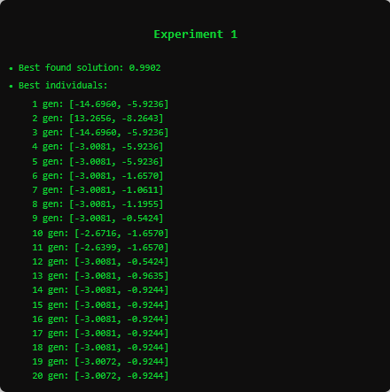
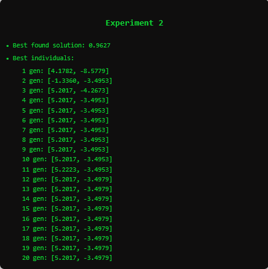
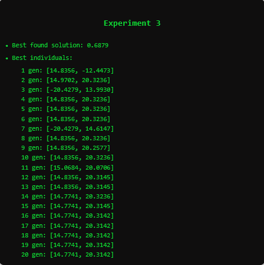
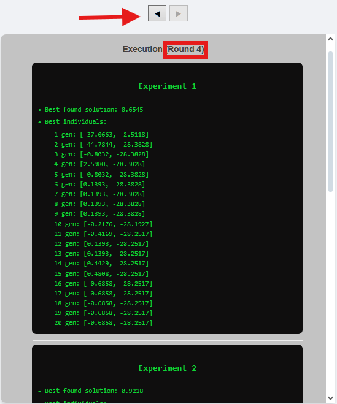

********************************
Best Solutions And Individuals
********************************

This section displays the **best solution found** and the **best individual of each generation** for **each experiment** within a given round. The goal is to provide a detailed overview of how the algorithm evolved across generations and which individuals contributed most to the final optimization result.

.. note::

   The number of generations configured in the navbar determines the vertical length of each experiment log. For example, in a round with 20 generations and 3 experiments, the system will present 3 blocks (one for each experiment) listing the best individual at each generation step and the best solution reached in that experiment.

Individual Representation
-------------------------

Each individual is represented as a vector. The length and interpretation of this vector depend on the dimensionality of the objective function:

- **Two-variable functions (e.g., f(x, y))**: Each individual is naturally represented as a vector with two components, `[x_val, y_val]`, both of which are meaningful inputs for evaluation.
- **One-variable functions (e.g., f(x))**: To maintain internal consistency, the algorithm transforms the function into a two-variable form by mirroring the expression, as implemented in the method `get_function`. This transformation ensures that both components of the vector contribute meaningfully to the fitness evaluation.

.. code-block:: python

   def get_function(self, func_str):
       x, y = sp.symbols('x y')
       func = sp.sympify(func_str)
       if len(func.free_symbols) == 1 and x in func.free_symbols:
           func = func + func.subs(x, y)
       return func, x, y

This ensures that the evaluation of an individual `[a, b]` in a single-variable function `f(x)` becomes `f(a) + f(b)`, effectively simulating a symmetrical 2D problem without losing generality or requiring code branching for different dimensionalities.

Visualization Layout
--------------------

Each experiment's output is structured as follows:

- The **best solution found** across all generations in the experiment.
- A list of the **best individual at each generation**, indicating the genotype (vector of variables) of the most fit candidate at that point in evolution.

This output is particularly useful for:

- Understanding convergence behavior within each experiment.
- Verifying the consistency of best individuals over time.
- Detecting patterns of stagnation or sudden improvements.

Multi-Round Navigation and Accumulation
---------------------------------------

When the checkbox **Keep Graph** is selected (available in the control section above the first chart), the platform preserves a history of previous rounds. This enables the user to browse the best individuals and solutions for **each round** executed in the current session.

Navigation is made possible using the **arrow buttons** at the top of the container, allowing a seamless review of the evolutionary process across multiple rounds.

.. important::

   If the user **unchecks** the Keep Graph option before running the algorithm again, all previously accumulated results from earlier rounds will be lost. Therefore, it is highly recommended to **keep the option selected** if you wish to analyze the evolution across rounds.
