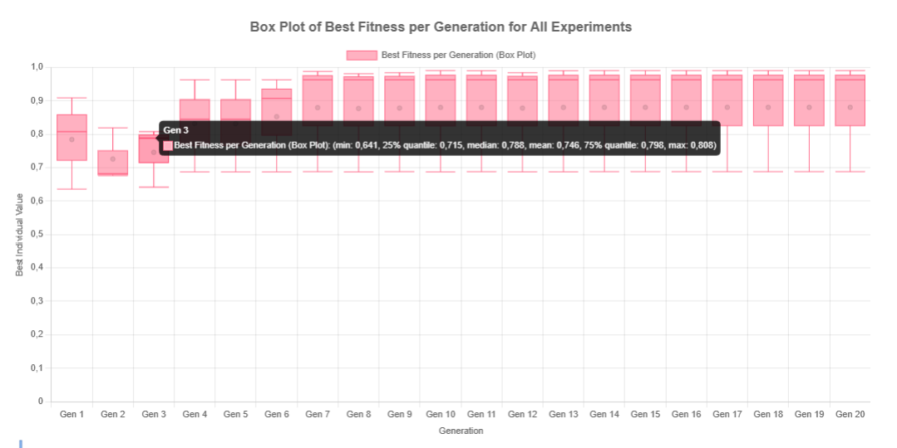

*********
Box Plot
*********

The **Box Plot** view provides a detailed statistical breakdown of the best individual values found across all experiments for each generation.

Overview
========

This chart complements the "Average of Best Fitness Per Generation" view by adding **descriptive statistical insights** for each generation. Instead of a single average value, the box plot displays the **distribution** of the best individuals' fitness values across all experiments in a given generation.

Box Plot Elements
=================

For each generation, the following statistical components are visualized:

- **Minimum (min):** The lowest fitness value obtained among the best individuals of all experiments.
- **First Quartile (Q1 - 25% quantile):** The value below which 25% of the best individuals lie.
- **Median (Q2):** The middle fitness value among all best individuals — half are better, and half are worse.
- **Mean:** The arithmetic average of all best individual values in that generation.
- **Third Quartile (Q3 - 75% quantile):** The value below which 75% of the best individuals lie.
- **Maximum (max):** The highest fitness value obtained among the best individuals.

Interpretation Example
=======================

As seen in the image, in **Generation 3**, the box plot reveals the following:

- **min:** 0.641
- **Q1 (25% quantile):** 0.715
- **median (Q2):** 0.788
- **mean:** 0.746
- **Q3 (75% quantile):** 0.798
- **max:** 0.808

This indicates that while some individuals achieved high fitness scores, there's also a noticeable spread, suggesting variability in convergence during this generation.

By observing how these statistics evolve from generation to generation, users can **diagnose convergence behavior**, **outliers**, and **stability** of the algorithm's performance over time.

.. note::

   The box plot is particularly useful for comparing variability between generations and identifying trends such as premature convergence, stagnation, or healthy diversity throughout the evolutionary process.
