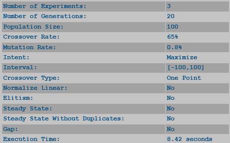

*****************
Chosen Params
*****************

To enhance user experience and streamline the analysis process, GADEMO displays all parameters selected for each experimental round in a structured summary table. This feature eliminates the need for users to manually track, memorize, or re-access the navigation panel to verify configuration details.

The displayed table summarizes critical parameters such as the number of experiments, generations, population size, crossover and mutation rates, as well as configuration options like elitism, linear normalization, steady-state mode, and the chosen objective (maximize or minimize). Additionally, it records the execution time, allowing users to monitor the computational efficiency of their experiments.

By offering this immediate and organized feedback, GADEMO ensures greater clarity and reproducibility in comparative analysis, facilitating informed decision-making and fostering best practices in experimentation with Genetic Algorithms.