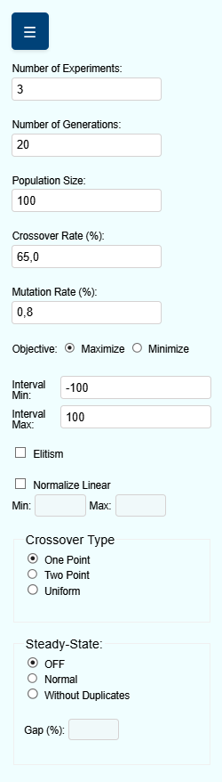

************
Navbar
************

The **navbar** of GADemo serves as the main control panel through which the user customizes the Genetic Algorithm (GA) execution parameters. This section provides a comprehensive explanation of each configuration item, enabling precise control over the optimization process.

.. contents::
   :local:
   :depth: 2

Number of Experiments
---------------------
This field defines how many **independent experiments** will be executed within a single round. Each experiment starts with a different initial population but follows the same configuration parameters. It is particularly useful for evaluating the consistency and robustness of results under stochastic variability.

Number of Generations
---------------------
Specifies the **number of generations** for each experiment. A generation represents a complete cycle of selection, crossover, and mutation. Higher values generally allow more opportunities for convergence toward optimal solutions.

Population Size
---------------
Indicates how many individuals compose each generation. A larger population may enhance exploration but increases computational cost. Smaller populations converge faster but may risk premature convergence.

Crossover Rate (%)
------------------
Sets the probability (in percentage) that the crossover operator will be applied to a pair of selected individuals. Crossover promotes genetic diversity by combining the information of two parents to generate new offspring.

Mutation Rate (%)
-----------------
Defines the likelihood (in percentage) that a gene (individual value) will undergo mutation. Mutation prevents stagnation by introducing small random changes in individuals, promoting broader exploration of the search space.

Objective
---------
Allows the user to specify whether the goal of the optimization is to **maximize** or **minimize** the objective function.

Interval Min / Max
------------------
Determines the **search space boundaries** for the variables of the objective function. All generated individuals will have values constrained between these two limits.

Elitism
-------
When enabled, **elitism** preserves the best individuals from one generation to the next. This guarantees that the best found solutions are never lost during the evolutionary process, improving the convergence of the algorithm.

Normalize Linear
----------------
Activates **linear normalization** of fitness values, which rescales raw values into a defined interval (specified by the user) to improve selection pressure. Useful when dealing with objective functions with large value ranges or outliers.

Crossover Type
--------------
Offers three methods for recombination:

- **One Point**: A single point is selected, and genetic material is exchanged after this point.
- **Two Point**: Two points are selected; genes between them are swapped.
- **Uniform**: Each gene is exchanged based on a fixed probability (usually 50%).

Steady-State Mode
-----------------
Defines how new individuals are incorporated into the population:

- **OFF**: Standard generational replacement.
- **Normal**: Combines a portion of the old population with new offspring.
- **Without Duplicates**: Same as "Normal", but discards any offspring identical to current population members.

Gap (%)
-------
Only available when Steady-State is enabled. This parameter defines the **proportion of the population** that will be replaced by offspring in each generation. It must be expressed as a percentage.
