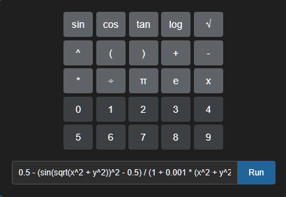

*****************
Numeric Keyboard
*****************

GADemo provides a **numeric virtual keyboard** designed to enhance the user experience, particularly for those accessing the platform via mobile devices or touchscreens. This feature allows for quick and intuitive input of numerical parameters directly into the interface, without relying on the device's default keyboard layout.

While users are entirely **free to use either the physical keyboard** or the on-screen numeric keyboard, the virtual keyboard was developed with a focus on **mobile accessibility and practicality**. It ensures that even in scenarios where physical keyboards are unavailable or less convenient—such as tablets or smartphones—users can interact fluidly with the parameter fields required for Genetic Algorithm configuration.

.. note::

   Although the virtual keyboard supports mobile usage, it is important to highlight that **GADemo's mobile version is still under active development**. Consequently, some elements may not yet display responsively on all screen sizes. For optimal experience and full functionality, the use of a desktop or laptop computer is currently **strongly recommended**.

